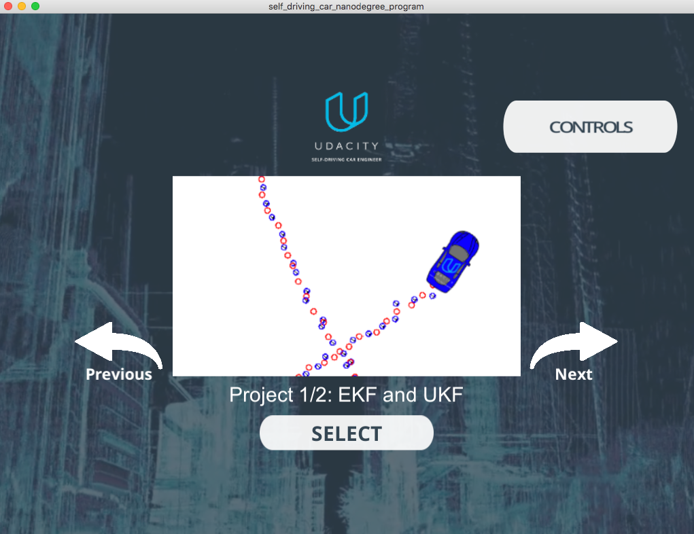
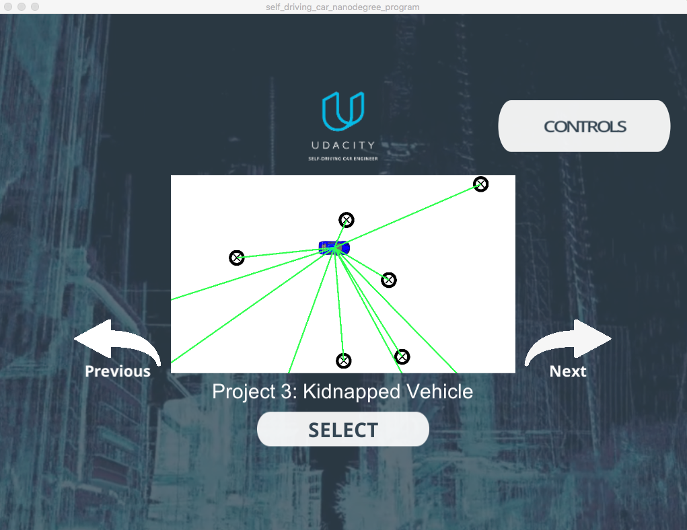
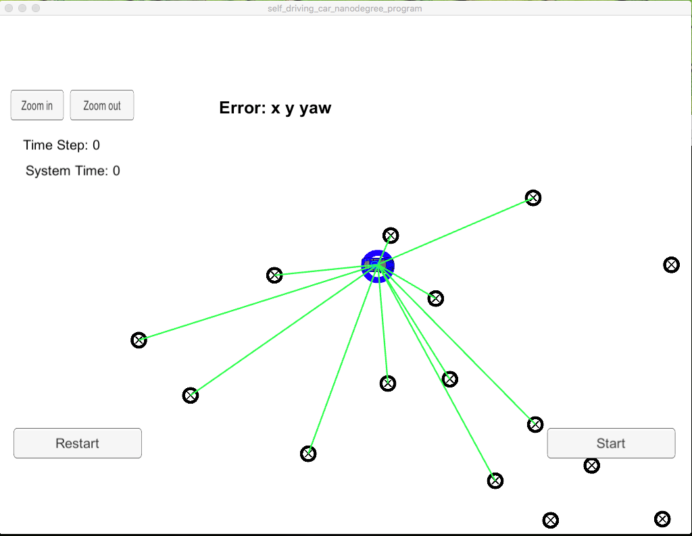
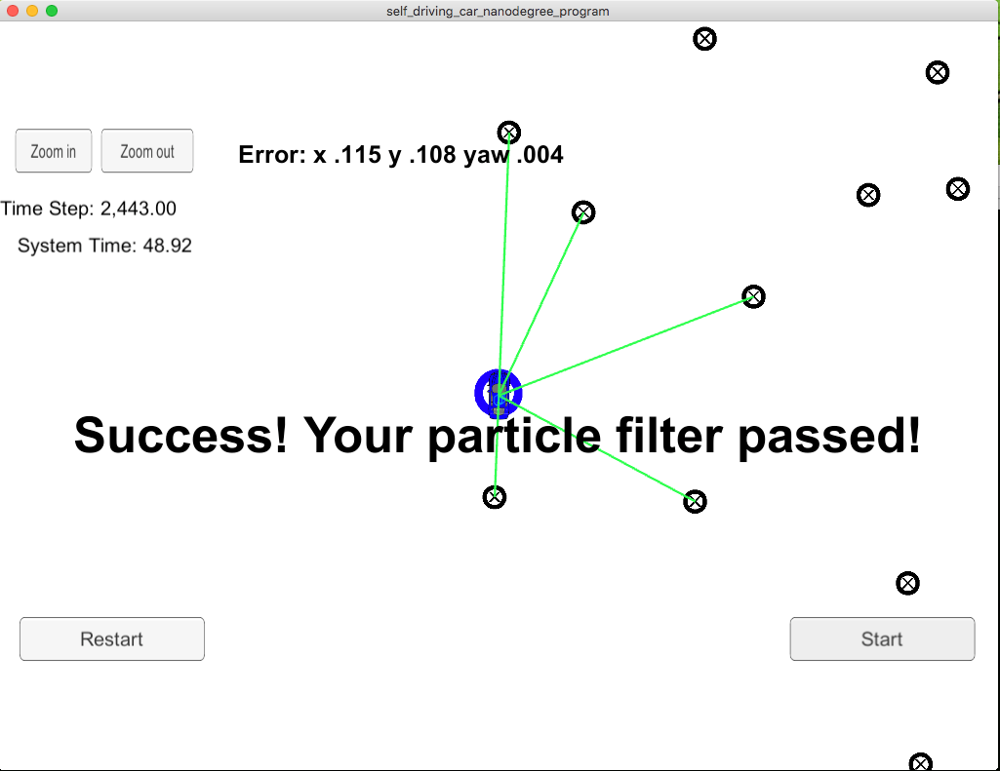

# About Kidnapped Vehicle Project
This codebase holds my solution to localize a kidnapped vehicle using particle filters. The content below is part of original Udacity Kidnapped Vehicle project on github. 

# Overview
This project implements a [Particle Filter](https://en.wikipedia.org/wiki/Particle_filter) applied to a [Kidnapped robot(car) problem](https://en.wikipedia.org/wiki/Kidnapped_robot_problem). A simulator is provided by Udacity ([it could be downloaded here](https://github.com/udacity/self-driving-car-sim/releases)).

# Compiling and executing the project

In this project, Udacity's seed repo provides scripts to clean, compile and run it. These are the following commands you need to run from this repo directory

```
> ./clean.sh
> ./build.sh
> ./run.sh
```

You will see a message indicating the filter is listening:

```
> ./run.sh
Listening to port 4567

```

# Glimpse



Using the right arrow, you need to go to the Kidnapped Vehicle project:



Clicking on "Select," the simulator for the Kidnapped project start and the Particle Filter informs it is connected:



Clicking on "Start" button, the vehicle starts moving, and the blue circle(the filter calculated position) moves with it. After a while, the simulator informs you if your Particle Filter passed or failed. Here is an example of the filter passing the test:



# Code description

The Particle Filter is implemented in [src/particle_filter.cpp](./src/particle_filter.cpp)

